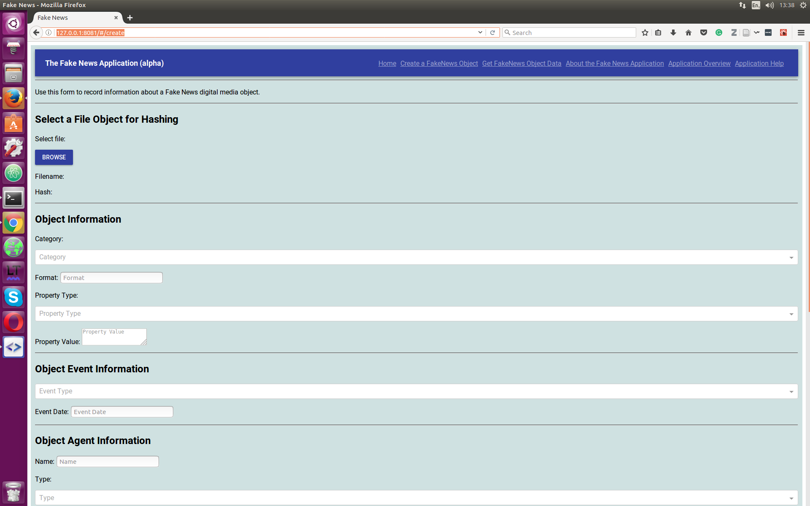

# Provenator

**Provenator** is the result of the academic paper called, **Fake News - a Technological Approach to Proving Provenance Using Blockchains**. It is an early prototype, developed by [Steve Huckle](http://www.sussex.ac.uk/profiles/307882) in the [University of Sussex Informatics Department](http://www.sussex.ac.uk/informatics/).

The source code of the application can be found under the [src](src) directory. The [Install Guide](src/INSTALL.md) gives brief instructions as to how to get the application running. However, if you have any problems installing **Provenator**, please do email s dot huckle @ sussex dot ac dot uk.

If, rather than install the source software, you'd rather just use **Provenator**, then we are waiting for the IT Services Department of the University of Sussex to supply us with the appropriate hardware and Internet connection for hosting **Provenator**. As soon as they do, there will be a working demonstrator of the app', which will use the [Ethereum Testnet Rospten](https://github.com/ethereum/ropsten), so it won't cost any real Ether to load a media resource and register its provenance. Please watch this space.

Meanwhile, here's a tempting screenshot of the app' in action:

## Licensing

Please be aware of [licensing](docs/LICENSE.md). In short, everything in this repository is shared under the Creative Commons license [CC BY-NC-SA 4.0](https://creativecommons.org/licenses/by-nc-nd/4.0/). That allows you to share, copy and redistribute the material in any medium or format, as well as remix, transform, and build upon the material. However, any use must not be commercial, you must give appropriate credit, and any derivatives must be shared under the same [CC BY-NC-SA 4.0](https://creativecommons.org/licenses/by-nc-nd/4.0/) license.
